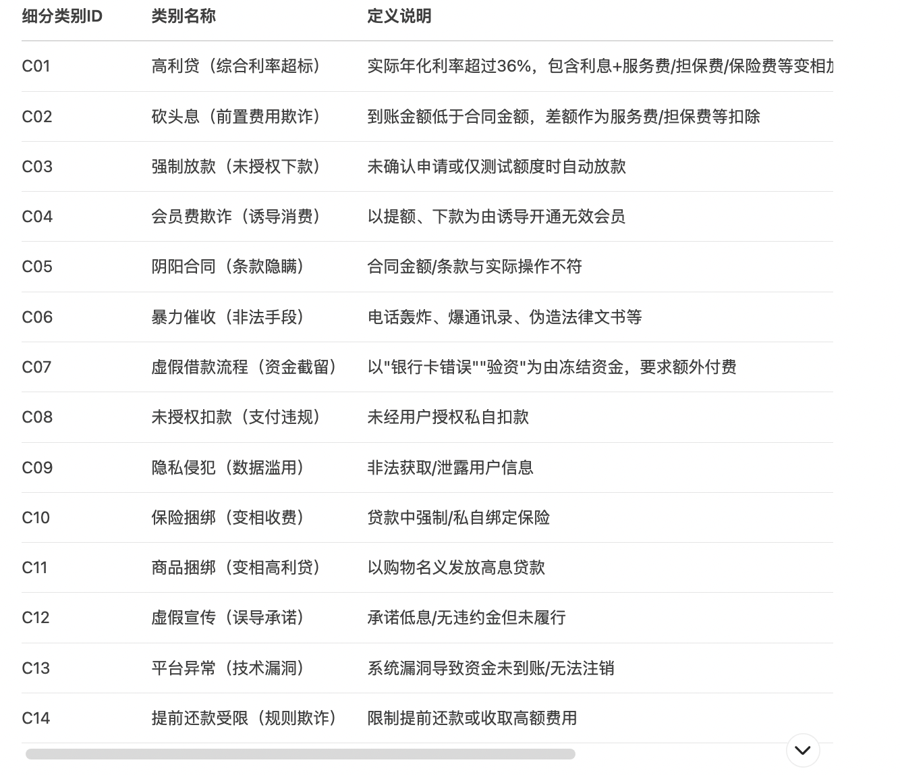
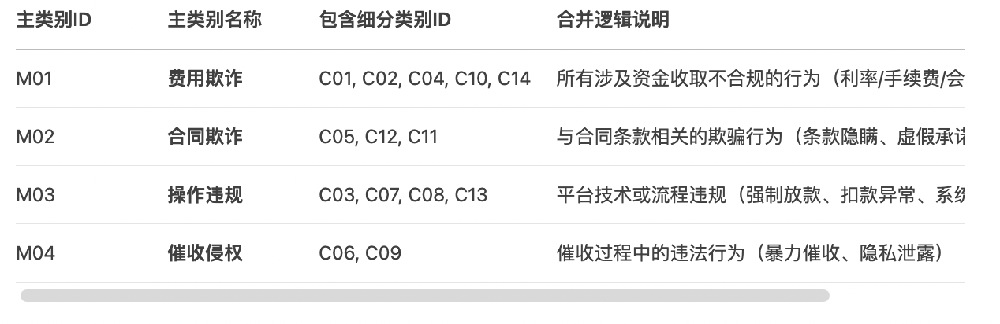

# 整理一下新的投诉的样本（确认是否需要补充一些非放贷商家）
## 1. financialmerchant.py **处理后的商家列表.csv**
* 删除已经筛选出来的金融类商家
* 删除已经筛选的旅游类商家
* 根据公司名称可以判别类别的删除

## 2. merchant_delete.py **处理后的商家列表.xlsx**
* 在筛选的过程中通过名称剔除

# 对投诉文本分类做异质性 
## 全文本生成**classify_sample.csv**
## text_sample_classify.py
* 根据命令将文本分类成是否隐私相关的投诉
* 根据命令将文本分类成是否欺诈相关的投诉

## double_check.py
* 根据上面生成的分类换模型重新生成分类标准
* 生成一列比对生成的结果是否一致（一致更好判断）

## business_classify.py
* 根据投诉的文本具体判断业务的类型（投诉人具体用的是哪个业务）
### without2.py
* 类别2是信用卡业务可以单独处理

### check3.py
* 原始文件对于3的类别定义并不太清楚
* 针对3的类别添加了车贷/教育分期等更加清晰的条件
* 已经筛选出来明确不涉及这些业务的类型不参与分类

* vip/会员/征信报告 也可以通过关键词处理
## 生成欺诈的原始分类文件
* 生成**sample_fraud.csv**是从欺诈的文本中随机抽取5000条，但是没有根据投诉内容删除重复值，并且没有保留生成这个文件的代码

## sample_check.py
* 1. 首先复核一下提取出来的excel文件中投诉内容是否都是欺诈样本
* 2. 删除重复值后不足5000条要在未提取的投诉中随机抽取补足
* 3. 保证没有重复值，补充生成**classify_fin.csv**

## fin_sample_check.py
* classify_fin.csv中包含的360的投诉太多了，现在需要删除一些
* 筛选出许多需要删除的商家，控制他们的投诉数量
* 从剩余的投诉中筛选更多丰富的商家信息补充进来 **classify_fin_processed.csv**

## 1. privacy_classify.py：是否依赖个人信息的类别分类
* 依赖/不依赖个人信息实施的欺诈行为
* 根据文件**fruad_privacy_serious.xlsx**编著结果进行分类

## 2. fraud_classify.py
* 我们需要把样本分为个人信息依赖相关的欺诈与不相关的欺诈
* 这中间会有一些难以判断的模糊部分（如隐藏费用，高利贷）
* 因此在分类过程中我们把明确利用信息与完全不利用信息两个类别
* 并且筛选出对应的子分类，方便做进一步的分类 
* 根据**合并结果.xlsx**标注内容进行分类

## 3. BertTrain.py
* 根据fraud_classify.py中筛选出来的类别进行大样本多分类
* 多类别调整性能
* 类别不均衡影响分类效果

## 4. sample_add.py
* 排除掉已经筛选出来的投诉内容
* 按照年份/商家均匀抽取投诉内容3000条进行补充分类 **sample_add.csv**

## 5. sample_add_classify.py
* 以**supplement_fraud_sample_3000.xlsx**文件为基础进行再分类**sample_add.csv**

# fraud_privacy.py
* 筛选出既是欺诈又是隐私的投诉内容

# delete_clear.py
* 在欺诈投诉中剔除掉明示投诉的内容

# random_allocation.py
* 随机分配生成三个文件train/dev/test
* 冻结/解冻也涉及到非法使用信息
* 诱导授权、自动勾选、默认捆绑

# random_allocation_complicate.py
* 针对复杂多分类任务的分类
# summary.py

## 3. text_sample_classify.py
* 根据金融欺诈的业务类型筛选出一些典型的类型进行分类
高利贷与超高利息 砍头息与虚假到账 隐藏费用与捆绑销售 暴力催收与骚扰 虚假合同与阴阳条款 强制放贷与未授权操作 虚假宣传与诱导贷款 变相收费与商品捆绑

A1 强制放款

A2 高利贷

A3 砍头息

A4 阴阳合同

A5 强制增值服务

A6 虚假宣传

A7 暴力催收

A8 提前还款受限

A9 身份盗用

A10 违规服务费

A11 平台异常

A12 隐私侵犯

网贷/现金贷业务/信用卡业务/消费分期业务/支付/扣费业务
